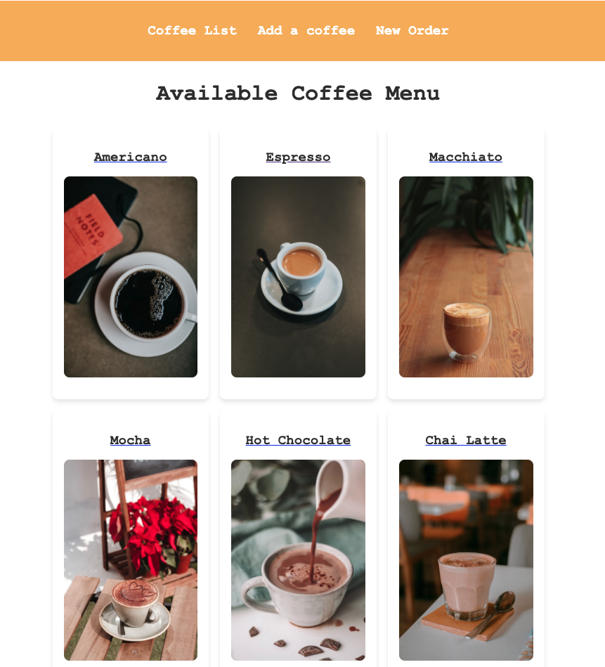

# ☕ CoffeeApp – Angular 19

A simple **Angular SPA** for listing coffees, viewing details, and creating new orders.  
Built using **standalone components**, routing, services, and guards.  
The app can fetch data from a public API or use local mock data.

---

## 🚀 Run the App

Make sure you have **Node.js 18+** and **Angular CLI** installed.

```bash
# 1) Install dependencies
npm install

# 2) Run in development mode
ng serve --open
# Opens at http://localhost:4200

# Production build
ng build
```

---

## 🧠 Tech Stack
- Angular 19 (Standalone components)  
- TypeScript, RxJS  
- Angular Router for navigation  
- HttpClient for API calls  
- Route Guards for restricted pages  
- Simple CSS per component

---

## 📁 Project Structure
```
coffee/
├─ package.json
├─ angular.json
├─ src/
│  ├─ main.ts
│  ├─ index.html
│  ├─ styles.css
│  └─ app/
│     ├─ app.component.ts / .html / .css
│     ├─ app.routes.ts           # Route definitions
│     ├─ app.config.ts           # Providers (Router, HttpClient, etc.)
│     ├─ services/
│     │  └─ coffee.service.ts    # API & data logic
│     ├─ guards/
│     │  └─ permissions.guard.ts # Example route guard
│     ├─ coffee-list/
│     │  ├─ coffee-list.component.ts / .html / .css
│     ├─ coffee-detail/
│     │  ├─ coffee-detail.component.ts / .html / .css
│     ├─ add-coffee/
│     │  ├─ add-coffee.component.ts / .html / .css
│     └─ new-order/
│        ├─ new-order.component.ts / .html / .css
```

---

## 🔗 API Source
- The service uses a public API (SampleAPIs – Coffee) for hot coffee data:
// coffee.service.ts (example)
- private readonly API = 'https://api.sampleapis.com/coffee/hot';
If the API is unavailable, local mock data will be used.

---

## 🧭 Routes Overview
Example routes from app.routes.ts:
- / → CoffeeListComponent (coffee list)
- /coffee/:id → CoffeeDetailComponent (coffee details)
- /add → AddCoffeeComponent (add new coffee)
- /order/new → NewOrderComponent (create a new order, guard-protected)

---

## ✨ Features
- Coffee list with image, title, and ingredients
- Detailed coffee view
- Add new coffee form
- Example route guard for protected pages
- Centralized CoffeeService with HttpClient + RxJS
- Fully standalone components with Angular routing

--- 

## 🧪 Useful Commands

# Run app
ng serve --open

# Run tests
ng test

# Run linter (if configured)
npm run lint

---

## 📸 Preview



---

## 🧹 .gitignore
The .gitignore is already configured to exclude:
- node_modules
- dist
- .angular/cache
- System files (.DS_Store, Thumbs.db, etc.)
  
If node_modules was accidentally committed:
- git rm -r --cached node_modules
- git commit -m "Remove node_modules from repo"
- git push

---

## 📌 Author
Made with ☕ by Cristina — GitHub

---

## 📜 License
For educational purposes. Contributions are welcome!
